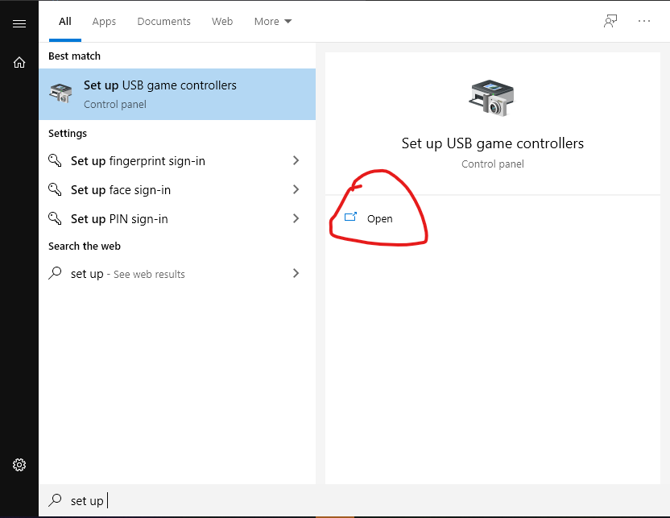
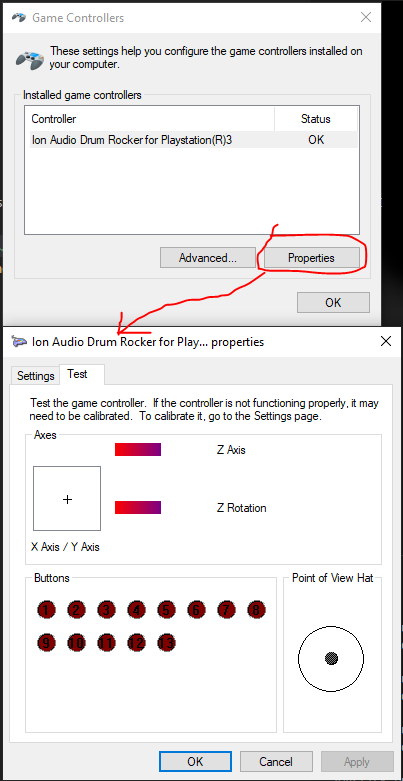

# Game Controllers
The only predefined controller I have is *Ion Audio Drum Rocker for Playstation(R)3*.

## Ion Audio Drum Rocker for Playstation(R)3

| drum or cymbal | 1-indexed combo* |
| -------------- | ----- |
| snare        | 3,11       |
| tom-tom 1 | 4,11       |
| hihat     | 4,12, up   |
| tom-tom 2   | 1,11       |
| ride        | 1,12, down |
| tom-tom 3  | 2,11       |
| crash      | 2,12       |

I don't know why sometimes the controller window shows only the first number of a combo instead of all.

\* See [Add a controller](##Add-a-controller) section for details.

## Inspect controller buttons
Here is how to open controller properties window to inspect what buttons are pressed.

Hit buttons and see what lights up.

## Add a controller
After you have inspected your controller, to set it up just open `config.json` and put appropriate values there.

**One key thing to remember** is that joystick buttons in the config are zero-indexed. If a button 1 lights up, write 0, for button 2 write 1 etc.